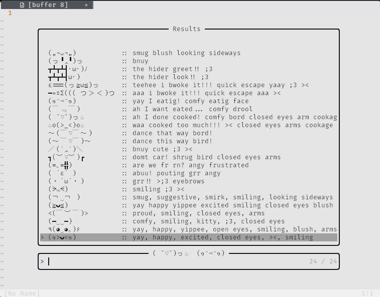

# Kaomoji Super-Kawaii Operations Control User Interface 
or just kaomoji for short (─‿‿─)



lazy
```lua
{
  'periaate/kaomoji.nvim',
  dependencies = { 'nvim-telescope/telescope.nvim' },
  keys = {
    {'<leader>kao', "<cmd>lua require('kaomoji').find_and_paste()<cr>"},
  }
}
```
